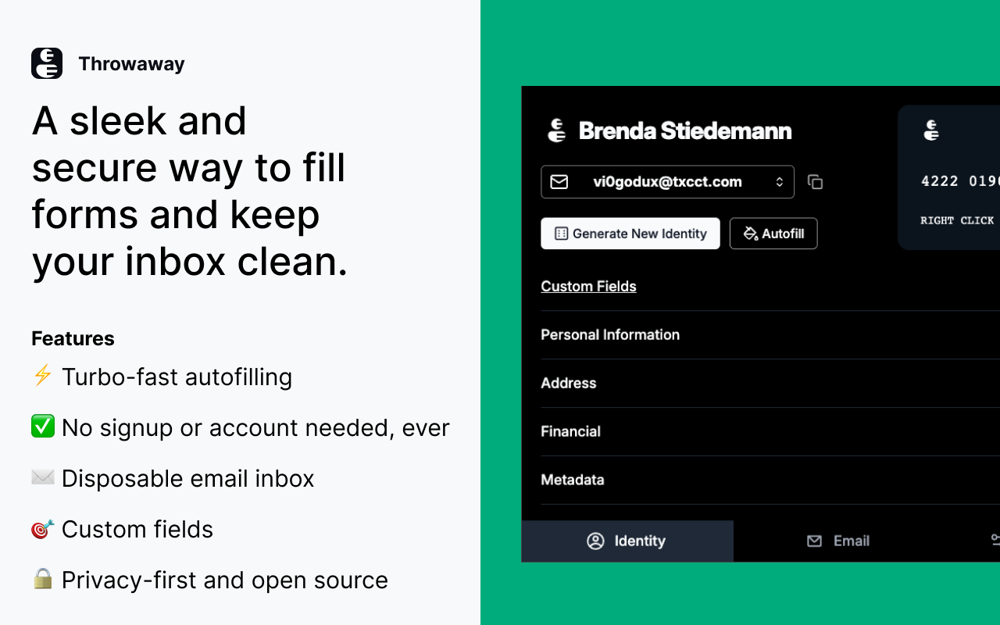
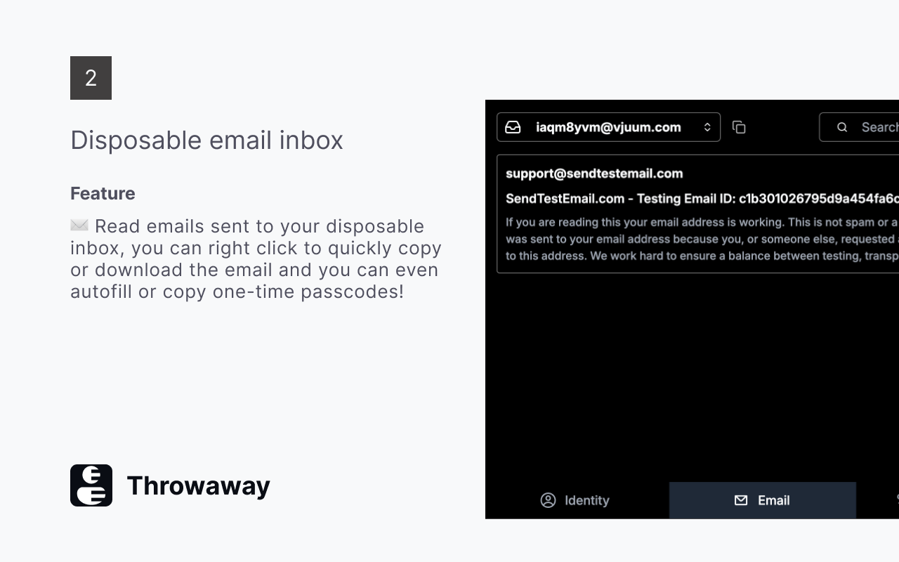

# Throwaway

**Stop giving websites your real data.**

Throwaway is a browser extension that fills forms with generated identities so you can protect your privacy, test auth flows, and iterate on payment forms without ever pausing your workflow.

[](https://chromewebstore.google.com/detail/throwaway/ckchejeejieimhknlpiipmmjcapomggi)
[](https://addons.mozilla.org/en-US/firefox/addon/throwaway/)
[](LICENSE)



---

## Features

**One-Click Autofill** — Right-click any page, select *Fill with Throwaway*, and every form field gets populated instantly. Fuzzy matching finds the right fields even with unusual labels.

**Stay Private** — Never hand your real email, name, or address to a site you've never heard of. Disposable email addresses keep your inbox clean and your identity yours. Everything runs locally; no data leaves your browser.

**QA Testing Speed** — Test signup forms, auth flows, and payment validation in seconds. Generate unique identities for each test iteration without manual data entry.

**Auto OTP Extraction** — The built-in inbox reads incoming verification emails and auto-extracts OTP codes. No more switching tabs to copy-paste codes.

**Payment Form Testing** — Generate Luhn-valid card numbers or use known test cards from Stripe, PayPal, and Amazon. Test declined, expired, and secure card flows without an external service.

**Extension-Native** — No separate tab to manage. Throwaway lives in your toolbar. Right-click to autofill, close the popup when done.

---

## Screenshots




---

## Install

- [Chrome Web Store](https://chromewebstore.google.com/detail/throwaway/ckchejeejieimhknlpiipmmjcapomggi)
- [Firefox Add-ons](https://addons.mozilla.org/en-US/firefox/addon/throwaway/)

---

## Build from source

### Requirements

- **Node.js:** v22 or later — [nodejs.org](https://nodejs.org)
- **pnpm:** v11 or later — `npm install -g pnpm`

### Setup

```bash
pnpm install
```

### Environment variables

Create a `.env.local` in the project root:

```
VITE_API_URL=<api_url>
```

The API URL is provided in the reviewer notes on the AMO submission.

### Build

```bash
# Chrome (MV3) — produces dist/throwaway-<version>-chrome.zip
pnpm run zip

# Firefox (MV2) — produces dist/throwaway-<version>-firefox.zip
pnpm run zip:firefox
```

### Development

```bash
# Chrome with hot reload
pnpm run dev

# Firefox with hot reload
pnpm run dev:firefox
```

---

## License

[MIT](LICENSE)
